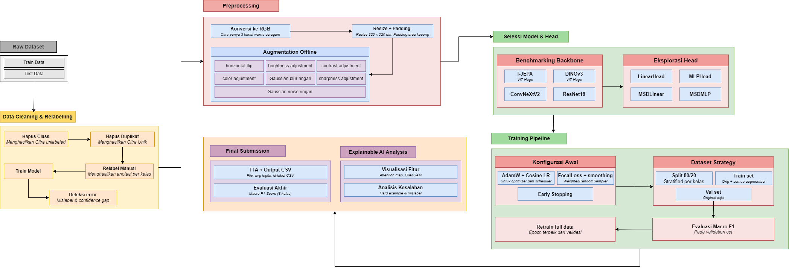

# Face Anti-Spoofing Detection

> **Competition:** Data Analytics Competition (DAC) — **Future Innovation and Discovery IT! (FindIT!) 2026**, Universitas Gadjah Mada (UGM)
> **Metric:** Macro F1-Score | **Team:** psi-1

---

## Problem Overview

Face recognition systems are increasingly deployed across sectors—mobile unlock, attendance, financial verification—yet remain vulnerable to **face spoofing**: attacks that deceive biometric systems using printed photos, screen displays, masks, or mannequins.

This project addresses the **DAC FindIT! 2026** Kaggle competition, where the task is to classify face images into **six classes** (`realperson`, `fake_printed`, `fake_screen`, `fake_mask`, `fake_mannequin`, `fake_unknown`) under varied lighting, angles, and attack types. The evaluation metric is **Macro F1-Score**, ensuring equal weighting across all classes despite potential imbalance.

---

## Approach

The pipeline uses a **DINOv3 ViT-Large** backbone with a **Multi-Sample Dropout (MSD) linear head**, trained in a two-phase strategy.

### Key Components

| Component | Choice | Rationale |
|-----------|--------|-----------|
| Backbone | `vit_large_patch16_dinov3` (timm) | Strong self-supervised representations, 1024-d output |
| Feature | CLS + mean patch token (2048-d) | richer representation than CLS alone |
| Head | Multi-Sample Dropout Linear (5 samples, p=0.25) | Regularization via dropout averaging |
| Loss | Focal Loss + Label Smoothing (γ=2.0, ε=0.02, α=1/√n) | Handles class imbalance + overconfidence |
| Optimizer | AdamW (backbone 3e-5, head 1.8e-4) | Differential LR for fine-tuning |
| Scheduler | CosineAnnealingLR | Smooth decay |
| TTA | Horizontal flip averaging | Boosts generalization at inference |

### Training Strategy

1. **Head Search Phase** — Stratified 80/20 split on original images only. Train with augmented data, validate on originals. Early stopping (patience=4) selects best epoch by val Macro F1.
2. **Full Retrain Phase** — Retrain from scratch on all 2,138 training samples for the selected epoch count.
3. **Inference** — TTA (original + flipped) → argmax over 6-class logits → CSV submission.

### Results

| Phase | Metric | Value |
|-------|--------|-------|
| Head Search | Val Macro F1 | **0.9726** |
| Head Search | Val Accuracy | **98.16%** |
| Full Retrain | Train Macro F1 | **1.0000** (epoch 5/6) |

---

## Pipeline Diagram



---

## Directory Structure

```
Face-Spoofing-Detection/
├── PROBLEM-SET.MD                          # Original problem statement (Indonesian)
├── README.md                               # This file
│
├── notebook/
│   └── Psi -1_Final-Pipeline.ipynb         # End-to-end notebook (EDA → Training → Submission)
│
├── script/
│   └── preprocess_dataset_v1.py            # Offline preprocessing + augmentation script
│
├── raw/
│   ├── train/                              # 2,138 images across 6 classes
│   │   ├── realperson/
│   │   ├── fake_printed/
│   │   ├── fake_screen/
│   │   ├── fake_mask/
│   │   ├── fake_mannequin/
│   │   └── fake_unknown/
│   └── test/                               # 404 unlabeled test images
│
├── processed/
│   └── preprocessing_v1/
│       ├── manifest.csv                    # 2,542-row manifest (train + test)
│       └── preprocessing_config.json       # Preprocessing parameters
│
├── artifact/
│   ├── eda_sample_images.png               # EDA: sample images per class
│   ├── eda_rgb_profile.png                 # EDA: RGB channel profiles
│   ├── eda_image_resolution.png            # EDA: resolution distribution
│   ├── eda_variant_distribution.png        # EDA: orig vs augmented counts
│   ├── full_retrain_history.csv            # Training log (6 epochs)
│   ├── head_search_summary.csv             # Head search results
│   └── msd_linear/
│       └── metrics.json                    # Best epoch metrics
│
└── submission/
    ├── ver34_clean_package_competition_submission.csv
    └── ver34_clean_package_competition_submission_from_saved_model.csv
```

---

## How to Run

### Prerequisites

```bash
pip install torch torchvision timm pillow opencv-python pandas numpy scikit-learn matplotlib seaborn tqdm
```

### Option 1: Run the Full Notebook

```bash
jupyter notebook "notebook/Psi -1_Final-Pipeline.ipynb"
```

Run all cells sequentially. The notebook handles:
- Environment detection (local / Kaggle / Colab)
- Preprocessing (calls `script/preprocess_dataset_v1.py`)
- EDA and visualization
- Head search + full retrain
- Inference and submission CSV generation

### Option 2: Run Preprocessing Only

```bash
python script/preprocess_dataset_v1.py
```

This generates `processed/preprocessing_v1/manifest.csv` and all preprocessed images.

### Option 3: Shortcut Inference (Skip Training)

If you have the saved checkpoint in `artifact/msd_linear/`, the notebook's **Section 10** loads it directly and runs inference without retraining.

---

## Citation

Muhammad Nafal Zakin Rustanto. Data Analytics Competition (DAC) Find IT! 2026. https://kaggle.com/competitions/data-analytics-competition-dac-find-it-2026, 2026. Kaggle.
